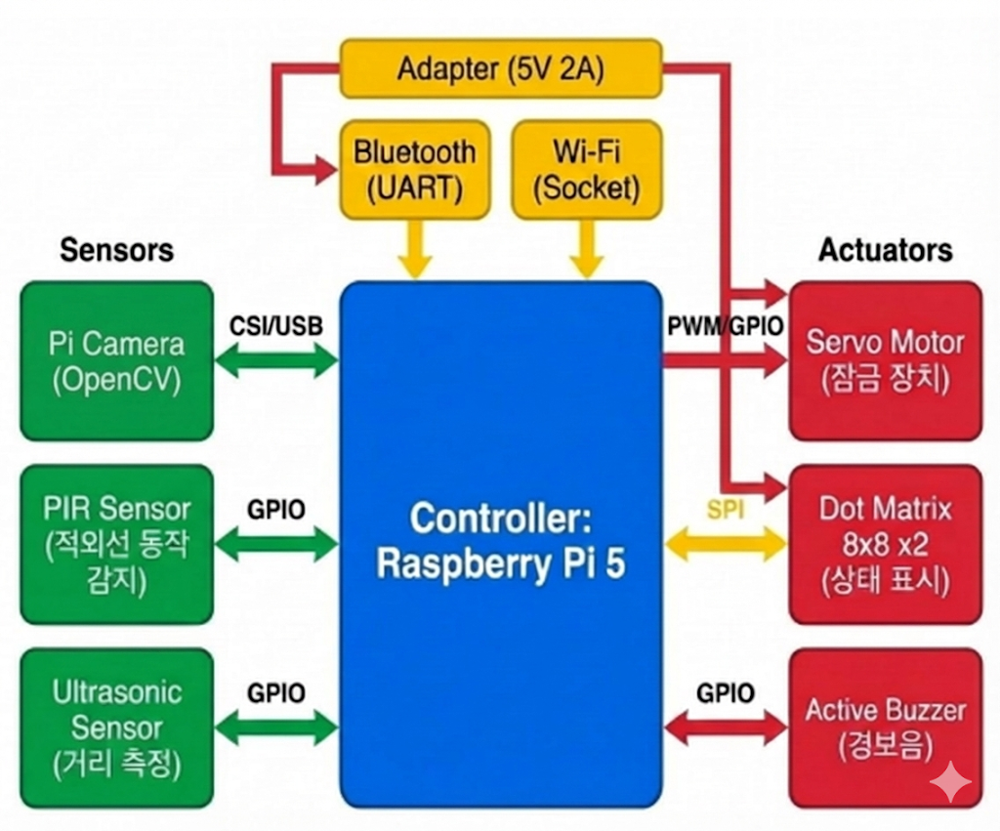

###  1. 프로젝트 개요

- **프로젝트 이름**: Sentry System
    
- **한 줄 요약**: 라즈베리파이 5의 고성능 컴퓨팅과 다중 센서를 융합하여 침입 감지부터 능동적 경고 및 원격 제어까지 수행하는 올인원 보안 터미널입니다.
    
- **주요 기능**:
    
    - 카메라 이미지 변화 검출 및 PIR 센서를 활용한 이중 침입 감지.
        
    - 초음파 센서를 통한 50cm 이내 근접 위협 감지 및 자동 사진 캡처.
        
    - 상황별(SAFE, WARN, DANGER) 시각적 아이콘 표시 및 경보음 송출.
        
    - 블루투스 통신을 통한 사용자 인증 및 도어락(서보 모터) 원격 제어.
        
    - Wi-Fi 네트워크를 통한 실시간 침입 로그 서버 전송.
	
## 2. 시스템 구성

- 전체 시스템 구조

### 하드웨어 구성

- **제어 보드**: Raspberry Pi 5.
    
- **센서**: Pi Camera (OpenCV 이미지 변화 검출), PIR Sensor (적외선 동작 감지), Ultrasonic Sensor (거리 측정).
    
- **액추에이터**: Servo Motor (잠금 장치), Dot Matrix 8x8 x2 (상태 표시), Active Buzzer (경보음).

### 소프트웨어 구성

- **프로세스 및 쓰레드**: 메인 프로세스 내에서 Display, Buzzer, Pipe Reader, Bluetooth, Wi-Fi 서버 등 총 5개의 쓰레드가 병렬로 운용됩니다.
    
- **통신 구조**:
    
    - **IPC**: Python(영상 분석)과 C(메인 제어) 간 Named Pipe(FIFO) 통신.
        
    - **Network**: Socket 통신 기반 Wi-Fi 알림 전송.
        
    - **Interface**: UART(Bluetooth), SPI(Dot Matrix), PWM/GPIO(Servo, Sensors).

### 사용 개발 환경

- **운영체제**: Raspberry Pi OS.
    
- **사용 언어**: C (메인 제어), Python (OpenCV 영상 처리).
    
- **컴파일러 및 라이브러리**: GCC, Pthread, WiringPi, OpenCV.

## 3. 제한조건 구현 내용 정리

- **멀티쓰레드 구조 설명**

	- 각 하드웨어 모듈과 통신 모듈을 독립적인 쓰레드로 분할하여, 특정 동작(예: 경보음 출력 시의 delay)이 다른 센서의 실시간 감지나 사용자 명령 수신을 방해하지 않도록 설계하였습니다.
	- // [main.c] 5개의 독립 쓰레드 생성
		`pthread_create(&th_disp, NULL, displayThreadFunc, NULL);`
		`pthread_create(&th_buzz, NULL, buzzerThreadFunc, NULL);`
		`pthread_create(&th_pipe_reader, NULL, opencvPipeReadThread, NULL);`
		`pthread_create(&th_bt, NULL, bluetoothThreadFunc, NULL);`
		`pthread_create(&th_wifi, NULL, wifiServerThreadFunc, NULL);`

-  **IPC 및 뮤텍스 사용 부분 설명**

	- **IPC (Named Pipe)**: 영상 처리에 유리한 Python과 하드웨어 정밀 제어에 유리한 C를 FIFO 방식으로 연결하였습니다. Python 프로세스가 `/tmp/opencv_fifo`에 감지 결과(0/1)를 쓰면, C 쓰레드가 이를 읽어 시스템 모드를 갱신합니다.
    
	- **뮤텍스 (Mutex)**: 여러 쓰레드가 전역 변수인 `current_mode` 및 인증 정보에 동시 접근할 때 데이터 손상을 방지하기 위해 `mode_mutex`와 `auth_mutex`를 사용하였습니다.
	- // [sensors.c] IPC 수신 시 뮤텍스를 통한 공유 자원 보호
		`if (read(fd, buffer, 1) > 0) {`
		    `pthread_mutex_lock(&mode_mutex);`
		    `if (buffer[0] == '1') opencv_motion_detected = 1;`
		    `else opencv_motion_detected = 0;`
		    `pthread_mutex_unlock(&mode_mutex);`
		`}`

## 4. 빌드 및 실행 방법

- **빌드 방법**
	-  make all
	- python3 -m venv venv
	- source venv/bin/activate 
	- pip install -r requirements.txt
	
	- **(터미널 2개 사용)**
	- 터미널 1
		- source venv/bin/activate
		- sudo python3 py_detector.py
	- 터미널 2
		- sudo ./sentry_system
	
	- Python 가상환경을 생성하고 requirements.txt를 통해 opencv-python, numpy를 설치해야 합니다.
	- `/dev/spidev0.0` 및 GPIO 제어를 위해 `sudo` 권한이 필요합니다.

### 5. 데모 소개 
- https://docs.google.com/file/d/1jrho-64VldzNCTCNqGlEL2mLy65kJQhE/preview

1. **평상시 (SAFE)**: 대기 상태로 도트매트릭스에 웃는 표정이 표시됩니다.
    
2. **침입 감지 (WARN)**: 카메라의 이미지 변화와 PIR 센서가 동시에 동작을 포착하면 1차 경고음이 울리고 주의 아이콘이 표시됩니다.
    
3. **근접 위협 (DANGER)**: 초음파 센서 50cm 이내로 접근 시 사이렌이 울리며 해골 아이콘이 점멸하고 증거 사진을 캡처합니다.
    
4. **원격 제어 (REMOTE)**: 블루투스 터미널로 비밀번호 입력 시 프라이버시 모드로 전환되어 감시를 중단하고 잠금을 해제합니다.

## 6. 문제점 및 해결 방안 / 한계

- **UART 및 SPI 핀 충돌**: 블루투스 활성화 시 SPI 핀 간섭으로 도트매트릭스가 작동하지 않던 문제를 핀 재배치를 통해 해결하였습니다.
    
- **전압 노이즈 및 블루투스 끊김**: 모터 구동 시 전압 노이즈로 인한 페어링 해제 현상을 외부 어댑터 전원 직결 및 도트매트릭스 밝기 하향 조정으로 해결하였습니다.
    
- **PIR 센서 플리커링**: 센서 출력값이 불안정한 문제를 해결하기 위해 마지막 감지 후 10초간 상태를 유지하는 소프트웨어 래칭(Latching) 로직을 적용하였습니다.

- **현재 버전의 한계점**
	- 움직임을 감지하기 때문에 사람이 앞에 서서 가만히 있으면 안전모드가 됩니다.
	- 카메라를 실시간으로 확인할 수 없고, 찍힌 사진이 사용자에게 전달되지 않고 하드웨어에 저장됩니다.
- **하고 싶었던 개선 사항**
	- 캡쳐한 사진 전달
	- 경량 인공지능을 사용한 객체인식

## 7. 팀원 및 역할

- **강승우**: 모터 및 블루투스 통신 제어
    
- **강현묵**: 카메라 제어
    
- **김태준**: 도트매트릭스, 부저, 초음파, PIR 제어
    
- **손예슬**: 와이파이 통신 제어
